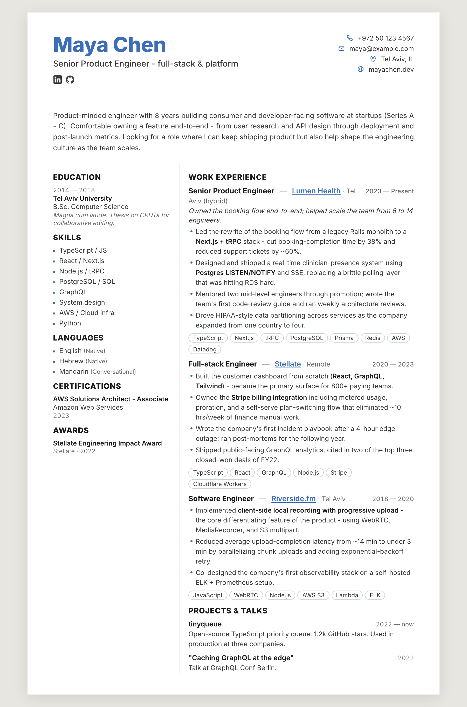

# CV Builder

A [Claude Code](https://claude.com/claude-code) skill that turns your raw career
history into job-tailored, print-ready CV PDFs.

It interviews you once to build a rich master file of everything you've done,
then generates a focused one-page CV for any job description you throw at it —
truthful to your experience, tuned to the role.



*Above: the bundled example (`skill/cv.example.json`) rendered with the default template.*

---

## How it works

The skill walks you through five phases:

| Phase | What happens | Output |
|-------|--------------|--------|
| **1. Interview** | Claude interviews you one question at a time, ingesting any CVs / LinkedIn / GitHub you have. | `experience.txt` — your master file, built once, reused forever |
| **2. Schema** | A fixed JSON schema every CV validates against. | `cv.schema.json` (ships with the skill) |
| **3. Tailoring** | You paste a job description; Claude scores every achievement against it, picks the strongest bullets, and mirrors the JD's language — without inventing anything. | `cv-{slug}.json` + a `cv-{slug}.notes.md` sidecar |
| **4. Rendering** | The JSON is rendered through an HTML template and converted to a PDF that auto-scales to fit one page. | `cv-{slug}.pdf` |
| **5. Packaging** | This repo. | An installable, shareable skill |

The core idea: **`experience.txt` is written once.** Every future CV is generated
from it in minutes — no re-interviewing.

A guiding rule throughout: **a CV that lies is worse than no CV.** Every bullet,
number, and skill traces back to something you actually told it. The tailoring is
strong *framing* of real facts, never fabrication.

---

## Requirements

- **[Claude Code](https://claude.com/claude-code)** — the skill runs inside it
- **Node.js** 18+ — runs the template renderer (`render.js`)
- **Python** 3.10+ — runs the PDF converter (`html_to_pdf.py`)
- **Playwright + Chromium** — headless rendering for the PDF step:
  ```bash
  pip install playwright && playwright install chromium
  ```

If Playwright isn't available you can still render the HTML and print to PDF from
a browser (Cmd/Ctrl+P → Save as PDF), but the auto-fit-to-one-page step needs it.

---

## Installation

Claude Code loads skills from `~/.claude/skills/`. Install by putting this skill's
files there.

### Option A — symlink (recommended for contributors)

Edits in the repo are picked up live, so you can hack on the skill and use it at
the same time.

```bash
git clone https://github.com/haialaluf/cv-builder.git
cd cv-builder
ln -s "$(pwd)/skill" ~/.claude/skills/cv-builder
```

### Option B — copy

```bash
git clone https://github.com/haialaluf/cv-builder.git
cp -r cv-builder/skill ~/.claude/skills/cv-builder
```

### Verify

Open Claude Code in any directory and run `/cv-builder`, or just ask
*"help me build a CV"* — the skill should trigger.

---

## Usage

1. **`cd` into a folder for your CVs** (keep it separate — it'll hold your private
   `experience.txt` and generated CVs).
2. **Start the skill** — type `/cv-builder` in Claude Code, or ask it to help you
   write or tailor a CV.
3. **First run:** Claude interviews you and writes `experience.txt`. Be generous —
   the richer this file, the better every future CV.
4. **Tailoring:** paste or link a job description. Claude proposes a strategy,
   waits for your OK, then writes `cv-{slug}.json`.
5. **Render:** confirm you're ready and Claude produces `cv-{slug}.pdf`.

Next job? Just paste the new JD — `experience.txt` is already there, so you skip
straight to tailoring.

### Rendering by hand

If you want to render outside Claude Code:

```bash
# JSON -> HTML  (SKILL_DIR = path to the installed skill folder)
node -e "const {render}=require('./skill/render.js'),fs=require('fs');\
fs.writeFileSync('out.html', render(fs.readFileSync('./skill/template.html','utf8'), require('./cv-mycv.json')))"

# HTML -> PDF  (auto-scales to fit one A4 page, down to 0.80x)
python3 skill/html_to_pdf.py out.html cv-mycv.pdf
```

---

## Repository layout

```
cv-builder/
├── skill/                  # the installable skill — this is what goes in ~/.claude/skills/
│   ├── SKILL.md            # the workflow Claude follows (phases 1–5)
│   ├── cv.schema.json      # JSON schema every cv.json validates against
│   ├── cv.example.json     # a complete, valid example CV
│   ├── render.js           # tiny Mustache-flavored template renderer (Node, zero deps)
│   ├── template.html       # the default CV template (two-column, print-ready)
│   └── html_to_pdf.py      # HTML -> PDF with auto-fit-to-one-page (Playwright)
├── examples/               # the example CV, rendered to HTML / PDF / PNG
├── CONTRIBUTING.md         # how to contribute — especially new templates
├── LICENSE
└── README.md
```

---

## Contributing

Contributions are very welcome — **especially new templates**. The renderer is
template-agnostic: any HTML file using the template syntax and reading the
`cv.schema.json` shape works as a drop-in. See **[CONTRIBUTING.md](CONTRIBUTING.md)**
for the template contract, the data shape, and how to test your work.

Bug reports, workflow improvements to `SKILL.md`, and schema suggestions are all
fair game too.

---

## License

[MIT](LICENSE) — use it, fork it, ship it.
